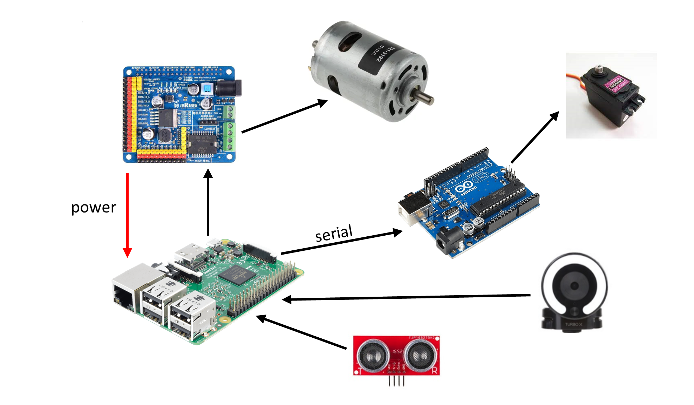
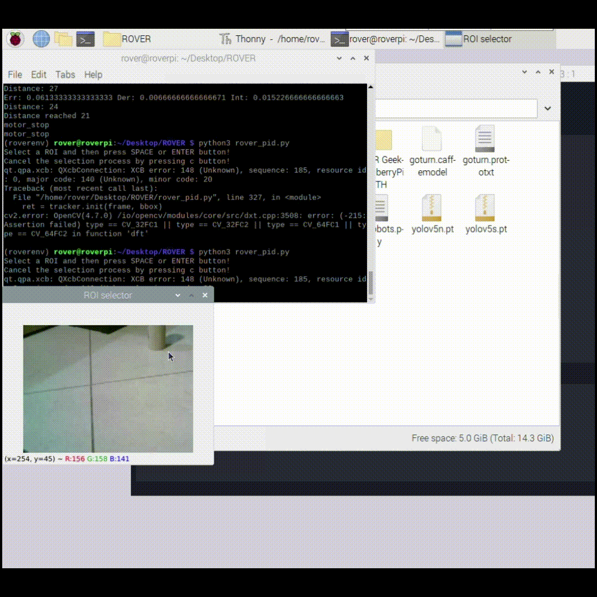
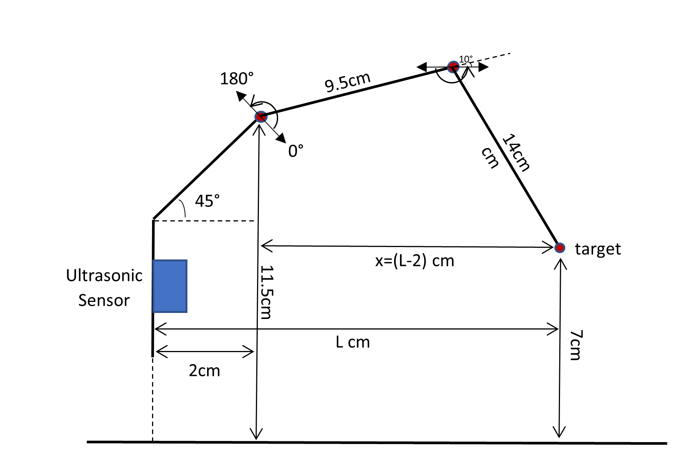
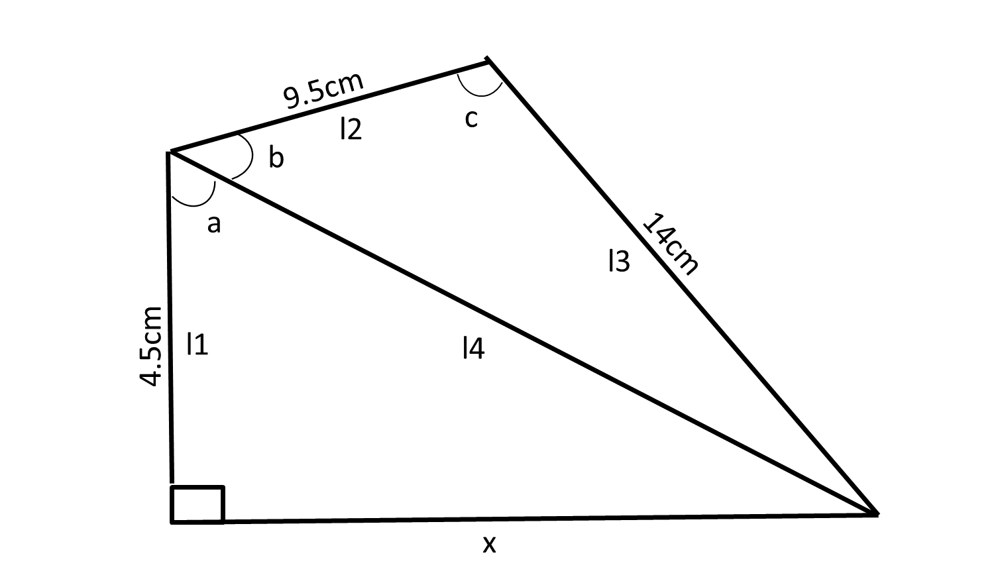

# Rover Hand
An autonomous robot based on Raspberry Pi 3 and Arduino that uses YOLOv5 to detect objects and OpenCV to track an object and catch it using a robotic hand.

https://user-images.githubusercontent.com/34167782/214393320-47a37205-f7fc-4b02-b69f-0544002efd65.mp4

# Materials
* A chassis and a robotic hand using servos
* Raspberry Pi 3
* XiaoR GEEK Expansion Board
* Arduino Uno
* Camera
* Ultrasonic sensor (HC-SR04)

# Libraries
* [YOLOv5](https://github.com/ultralytics/yolov5)
* [OpenCV Python](https://docs.opencv.org/4.x/d6/d00/tutorial_py_root.html)

# Hardware Overview and Connections
The XiaoR GEEK Expansion Board (powered by an external supply) is attached onto the Raspberry Pi 3 and is connected to the motors (using its built in L298N motor driver).   The Arduino is connected via USB and communicates with serial with the Raspberry Pi, and also controls the servo motors (which are powered by the expansion board).   The camera and the ultrasonic sensor are connected to the Raspberry Pi.  
 
   

# Software ([code](rover_pid.py))
## Tracking the object
The first part that needed to be implemented was an object tracker that is light (as the Raspberry Pi doesn't have much computing power) and relatively fast, as the robot will constantly be moving, so I decided to use one of the OpenCV trackers (in Python). After checking all the available ones, and other libraries as well, I decided to use the CSRT one, and choose the object in the image by hand.  
 
## Detecting 
Because I also wanted to add the option to automatically detect an object and then follow it and catch it, I added a code block that uses the YOLOv5 pretrained model to find all objects in the image, and then choose the one with the highest confidence value.  
The code that tested the two above parts is: [object tracker](object_tracker_opencv.py)

## PID Controller for following the object
The second part of this project was actually following the object and not losing it from the camera image. The parameter that I wanted to minimize was the ratio:
$$\large{error = \frac{x\ coordinate\ - image\ size/2}{image\ size/2}}$$
which takes values from -1 to 1 depending on the position of the center of the object within the frame. 
For the response of the robot to this error I created a function that maps integers from -1 to 1 to certain speeds of the robot. This converts x to values from $-speed$ to $speed$ for the motor to whose direction the robot needs to turn and a $speed$ value for the other motor (where $speed$ is a constant). 
At first, I tried the simple, Proportional, controller, where I plugged in the error to the response. The result was a bit of zig-zag, most times losing track of it. 
Next, I used a PID controller (standing for Proportional, Integral, Derivative), which takes into consideration the error multiplied by a constant $KP$, the rate of change of the error multiplied by $KD$, and the integral of the errors until that time, multiplied by $KI$. This can be summarized in this case by the following equation:
$$\large{response = last\ error\cdot KP+(last\ error-previous\ error)\cdot KD+sum\ of\ errors\cdot KI}$$
After some trial-and-error with the constants $KP$, $KI$, $KD$ I found some that worked very well for the action of tracking a standing object (It even worked pretty well when I moved it), so I moved on to the last step of actually catching the object.
  
<table><tr><td align="center"></td></tr><table> 

## Catching the object
For that last part I needed to convert the distance from the object at the end of the tracking, measured using the ultrasonic sensor, to the angles needed by the servos in order to catch the object. This required some trigonometry and it is described in the following diagrams and equations, representing the position of the robotic hand:  
 
  

$$\begin{flalign}& \large{\tan⁡a=\frac{x}{l_1} \to a=\arctan \frac{x}{l_1},\ \ l_4=\sqrt{l_1^2+x^2}} &\end{flalign}$$

$$\begin{flalign}& \large{l_3^2=l_2^2+l_4^2-2l_2l_4\cos⁡b \to b=\arccos⁡{\frac{l_2^2+l_4^2-l_3^2}{2l_2l_4}}} &\end{flalign}$$

$$\begin{flalign}& \large{l_4^2=l_2^2+l_3^2-2l_2l_3\cos⁡c \to c=\arccos⁡{\frac{l_2^2+l_3^2-l_4^2}{2l_2l_3}}} &\end{flalign}$$

$$\begin{flalign}& \large{angle1 = a+b-45\degree} &\end{flalign}$$

$$\begin{flalign}& \large{angle2 = c + 10\degree} &\end{flalign}$$

The last step is controlling the servos. For this, I send serial commands from the Raspberry Pi to the Arduino via USB, which determine the servo and the angle I want to move the servo to. The Arduino receives these commands and uses the Servo library to move them to the desired position.
 
 The code that tested the above process is: [hand code](hand_control.py)
 The Arduino code is the following: [arduino code](Arduino%20servo%20code/rpi_servo_control.ino)
  
 
